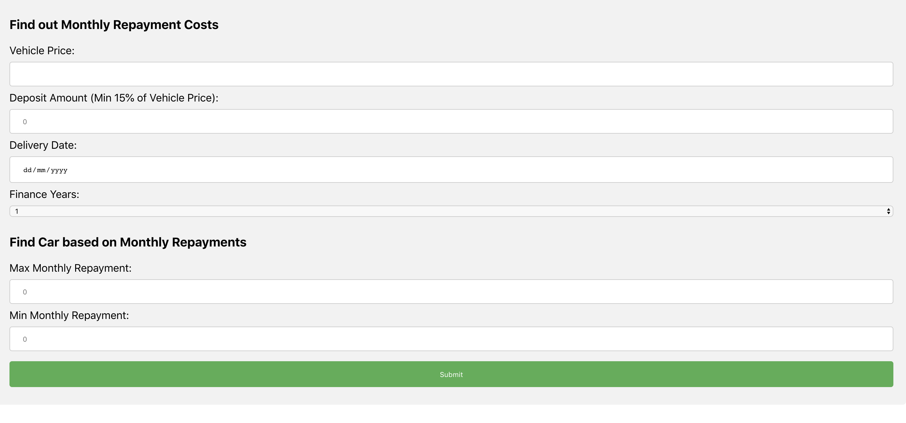
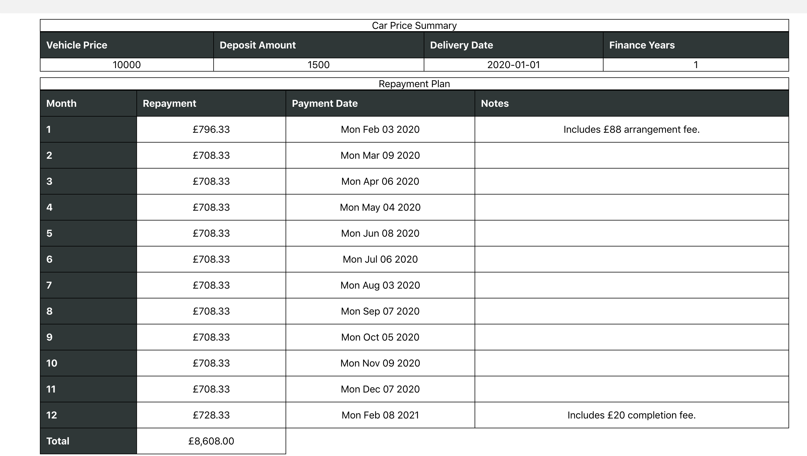

## Brief
 Create a web application that will allow one of our Product Consultants to produce a payment schedule for the new loan scheme.

* The application should allow the Product Consultant to input a vehicle price, deposit amount, delivery date and select from 1, 2 or 3 year finance options.

* There is a minimum 15% deposit.

* For the first month add an £88 arrangement fee, the last a £20 completion fee. These values should be easily configurable.

* Payments are due on the first Monday of each month, beginning the month after delivery.

* The completed application should calculate and display a quote showing a summary of the loan and a payment schedule showing monthly payments with date and amount due.

* Using this API display the top six vehicles which may be affordable based on the monthly payments `https://www.arnoldclark.com/used-cars/search.json?payment_type=monthly&min_price=100&max_price=150&sort_order=monthly_payment_up` This will return a JSON response. We're most interested in the `searchResults` array.

* Your code should reflect clean coding principles and contain tests.

## To run 

```
// terminal server directory
npm install
npm start
```
```
// terminal client directory
npm install
npm start
```

## Form

## Table

## List

